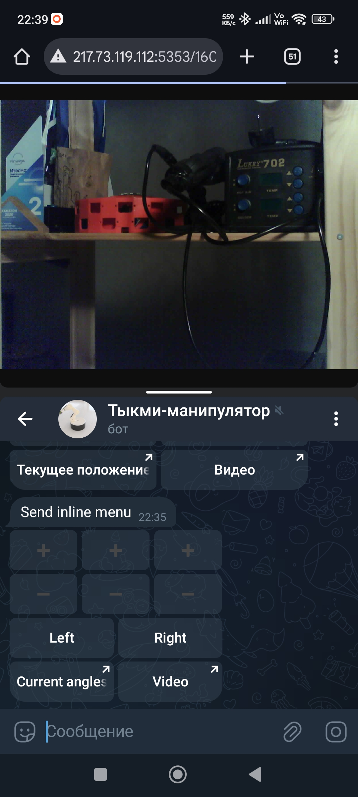
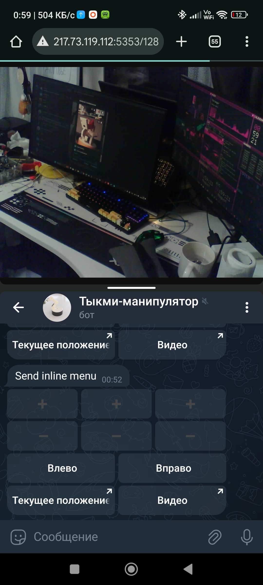

# Dum-E-Push-M — ESP32 Telegram‑Controlled Servo Manipulator

> 4‑DOF hobby‑servo arm controlled from Telegram inline buttons  
> Live video from an **ESP32‑CAM** at the end effector (tip), protected with **HTTP Basic Auth**  
> Secrets (Wi‑Fi, bot token, whitelist) are **not** committed to git — generated at build time

---


## Table of contents

- [Overview](#overview)
- [Hardware](#hardware)
- [Repository Layout](#repository-layout)
- [Quick Start](#quick-start)
- [Secrets Management](#secrets-management)
- [Build & Flash (PlatformIO)](#build--flash-platformio)
- [Telegram Bot Setup](#telegram-bot-setup)
- [How It Works](#how-it-works)
- [Configuration](#configuration)
- [ESP32-CAM Video (with HTTP Auth)](#esp32-cam-video-with-http-auth)
- [Usage](#usage)
- [Security Notes](#security-notes)
- [Troubleshooting](#troubleshooting)
- [Use Cases / Extending](#use-cases--extending)
- [3D model download](#3d-model)
---

## Overview

- **Project name:** Dum-E-Push-M  
- **Actuators:** MG996R + MG90 (4 total; configurable)  
- **Controller:** ESP32 (Arduino core, PlatformIO)  
- **Video:** ESP32‑CAM module at the tip, streaming via HTTP (Arduino example based), protected with Basic Auth  
- **Control UI:** Telegram inline keyboard (FastBot2)  
- **Motion:** Synchronized smooth moves to predefined poses; per‑joint incremental steps

> Photos and UI screenshots will be added later:
>
> - Arm photos (assembled) → `docs/img/arm-*.jpg`  
> - Split‑screen phone view (video top + Telegram bottom) → `docs/img/ui-split.jpg`

---

## Hardware

- **Servos:**  
  - 2× MG996R (high‑torque joints)  
  - 2× MG90 (light joints)  
- **MCU (manipulator):** Any ESP32 dev board with enough GPIO (pins are configurable)  
- **MCU (camera):** ESP32‑CAM module (separate board mounted at the end effector)  
- **Power:** External 5–6 V for servos (ensure adequate current; MG996R stall >2 A each). Common GND with ESP32.  
- **Mechanics:** 4‑DOF printed/assembled arm (angles 0–180° per joint).

> Provide a dedicated servo PSU and a common ground between PSU and controller.

---

## Repository Layout

```
.
├─ src/
│  └─ main.cpp                  # manipulator firmware (Telegram + servos)
├─ include/
│  └─ generated_secrets.h       # auto-generated, gitignored
├─ tools/
│  └─ gen_secrets.py            # pre-build script to generate secrets header
├─ platformio.ini               # PlatformIO config
├─ .secrets.example.json        # template for local secrets (copy → .secrets.json)
├─ .gitignore
└─ README.md
```

---

## Quick Start

1. **Install** PlatformIO (VS Code extension or CLI).  
2. **Create secrets** (choose one source):
   - Environment variables (`WIFI_SSID`, `WIFI_PASS`, `BOT_TOKEN`, `ALLOWED_IDS`), or
   - Local `.secrets.json` (gitignored), see [Secrets Management](#secrets-management).
3. **Build & flash** the `esp32dev` environment. The pre‑build script generates `include/generated_secrets.h`.  
4. **ESP32‑CAM**: flash the Arduino **CameraWebServer** example with Basic Auth changes (see below).  
5. Open Telegram and use the inline menu sent to `CHAT_ID` (first allowed ID).

---

## Secrets Management

Secrets are **not** committed. They are generated into `include/generated_secrets.h` by `tools/gen_secrets.py` at build time.

Add to `.gitignore`:
```gitignore
/include/generated_secrets.h
/.secrets.json
```

Example file to copy:
```jsonc
// .secrets.example.json
{
  "wifi_ssid": "YourAP",
  "wifi_pass": "YourPass",
  "bot_token": "123456:ABC-DEF",
  "allowed_ids": [111111111, 222222222]
}
```
Save as `.secrets.json` for local development.

**Environment variables (alternative):**

- Linux/macOS:
  ```bash
  export WIFI_SSID="YourAP"
  export WIFI_PASS="YourPass"
  export BOT_TOKEN="123456:ABC-DEF"
  export ALLOWED_IDS="111111111,222222222"
  ```
- Windows (PowerShell):
  ```powershell
  setx WIFI_SSID "YourAP"
  setx WIFI_PASS "YourPass"
  setx BOT_TOKEN "123456:ABC-DEF"
  setx ALLOWED_IDS "111111111,222222222"
  ```

The generated header defines (consumed by firmware):

- `#define WIFI_SSID "..."`  
- `#define WIFI_PASS "..."`  
- `#define BOT_TOKEN "..."`  
- `#define ALLOWED_USERS_COUNT N`  
- `#define ALLOWED_ID_0 ...` `#define ALLOWED_ID_1 ...` …  
- `#define CHAT_ID ALLOWED_ID_0` *(first allowed ID)*  
- `#define ALLOWED_USERS_LIST ALLOWED_ID_0, ALLOWED_ID_1, ...`  
- `static const long long ALLOWED_IDS[ALLOWED_USERS_COUNT] = { ALLOWED_USERS_LIST };`

If any secret is missing, the build fails with a clear `#error` from the generated header.

---

## Build & Flash (PlatformIO)

`platformio.ini` must contain:

```ini
[env:esp32dev]
platform = espressif32
board = esp32dev
framework = arduino

extra_scripts = pre:tools/gen_secrets.py
build_flags   = -include include/generated_secrets.h
monitor_speed = 115200
```

Build/Upload:
```bash
pio run -e esp32dev
pio run -e esp32dev -t upload
pio device monitor
```

---

## Telegram Bot Setup

1. Create a bot with **@BotFather** → obtain the **token** (set as `BOT_TOKEN`).  
2. Add your **numeric Telegram ID(s)** to `allowed_ids`.  
   - IDs can be 64‑bit; group chats may be negative.  
3. The first ID becomes `CHAT_ID` (admin/default chat).  
4. On first boot the bot sends the inline menu to `CHAT_ID`.

---

## How It Works

- **Control plane:** Telegram inline menu → FastBot2 → ESP32  
- **Motion:**  
  - Per‑joint incremental rotation (±5° by default)  
  - Smooth multi‑joint pose transitions with linear interpolation (`moveToPose`)  
- **Video:** ESP32‑CAM streams MJPEG over HTTP with Basic Auth

---
## PCB
<div align="center">
  
  &nbsp;&nbsp;&nbsp;&nbsp;
  
</div>

## Configuration

Edit `src/main.cpp`:

- **Servo pins**:
  ```cpp
  #define NUM_SERVOS 4
  static const int servoPins[NUM_SERVOS] = { 18, 19, 21, 22 }; // adjust to your wiring
  ```

- **Pulse range** (MG996R/MG90 tuning):
  ```cpp
  #define MIN_MICROS 800
  #define MAX_MICROS 2450
  ```

- **Predefined poses** (tune angles for your mechanics):
  ```cpp
  static const int defaultPose[4]       = { 90, 90, 90, 90 };
  static const int fullyExtendedPose[4] = { 90, 90, 90, 90 };
  static const int forwardUpPose[4]     = { 90, 90, 90, 90 };
  static const int forwardDownPose[4]   = { 90, 90, 90, 90 };
  ```

- **Smooth motion**:
  ```cpp
  moveToPose(defaultPose, /*stepDelayMs=*/20, /*maxAngleStep=*/1);
  // Increase stepDelayMs for slower motion; increase maxAngleStep for faster motion.
  ```

- **Inline menu** (labels + actions):
  ```cpp
  fb::InlineMenu menu(
      "➕;➕;➕\n"
      "➖;➖;➖\n"
      "Left;Right;\n"
      "Current angles;Video",
      "+1;+2;+3;-1;-2;-3;rotate_left;rotate_right;pos;http://<esp32-cam-ip>/"
  );
  ```

---

## ESP32-CAM Video (with HTTP Auth)

Base: Arduino IDE example **CameraWebServer** (`File → Examples → ESP32 → Camera → CameraWebServer`).  
Add a minimal **HTTP Basic Auth** check to each handler you need to guard (`/`, `/stream`, `/status`, `/control`, …).

> The snippet below illustrates the approach; include/encode functions may vary depending on the base64 helper you use.

```cpp
#include "esp_http_server.h"
#include "base64.h" // or any Base64 helper

static const char* WWW_USER = "admin";
static const char* WWW_PASS = "admin";
static const char* REALM    = "ESP32-CAM";

static bool check_auth(httpd_req_t *req) {
  char hdr[128];
  size_t n = httpd_req_get_hdr_value_len(req, "Authorization");
  if (n == 0 || n >= sizeof(hdr)) return false;
  if (httpd_req_get_hdr_value_str(req, "Authorization", hdr, sizeof(hdr)) != ESP_OK) return false;
  String expected = "Basic " + base64::encode(String(WWW_USER) + ":" + WWW_PASS);
  return expected.equals(hdr);
}

static esp_err_t auth_guard(httpd_req_t *req) {
  if (!check_auth(req)) {
    httpd_resp_set_hdr(req, "WWW-Authenticate", ("Basic realm=\"" + String(REALM) + "\"").c_str());
    httpd_resp_send_err(req, HTTPD_401_UNAUTHORIZED, "Unauthorized");
    return ESP_FAIL; // stop handling
  }
  return ESP_OK;
}

// Example usage in a handler:
static esp_err_t index_handler(httpd_req_t *req) {
  if (auth_guard(req) != ESP_OK) return ESP_FAIL;
  // ... existing handler code ...
  return ESP_OK;
}
```

Change `WWW_USER`/`WWW_PASS` and guard all relevant routes.

---

## Usage

1. Power the manipulator and ESP32‑CAM.  
2. The manipulator connects to Wi‑Fi; IP is printed to Serial.  
3. The bot sends an inline menu to `CHAT_ID`.  
4. Use buttons:
   - `+1/-1`: joint #1 ±5°  
   - `+2/-2`: joint #2 ±5°  
   - `+3/-3`: joint #3 ±5°  
   - `Left/Right`: joint #0 ±5°  
   - `Current angles`: sends current joint angles  
   - `Video`: opens ESP32‑CAM URL (HTTP Basic Auth)

> Intended usage: on a phone, **split screen** — video on top, Telegram below.

---

## Security Notes

- Secrets are not stored in git; they are generated at build time.  
- Telegram IDs are treated as **64‑bit**; groups can be negative.  
- For production: consider Wi‑Fi provisioning + **NVS encryption** (ESP32) so secrets are not stored in plaintext firmware.  
- HTTP Basic Auth is simple; for untrusted networks, place the stream behind a VPN or reverse proxy with TLS.

---

## Troubleshooting

- **Build error: `redefinition of ALLOWED_IDS`** — Do **not** define `ALLOWED_IDS` in sources; it comes from `generated_secrets.h`.  
- **Build error: `#error Missing secrets: ...`** — Provide ENV vars or `.secrets.json`.  
- **Bot not responding** — Verify `BOT_TOKEN`, check that your ID is in `allowed_ids`, confirm Wi‑Fi connection in Serial log.  
- **ESP32‑CAM asks for auth repeatedly** — Check Authorization header formatting and Base64 value; try a private browser window.  
- **Servos twitch/jitter** — Use a proper PSU; common GND; tune `MIN_MICROS`/`MAX_MICROS` for your servo models.

---

## Use Cases / Extending

- Basis for **DIY monitoring/control** cameras with physical actuation  
- Lab automation and remote inspection  
- Educational robotics/kinematics  
- Add IK, trajectories, limit switches, current sensing, safety interlocks

---

## 3D Model
### You can find all components here: https://grabcad.com/library/push-m-dum-e-robot-arm-4-axis-1
---